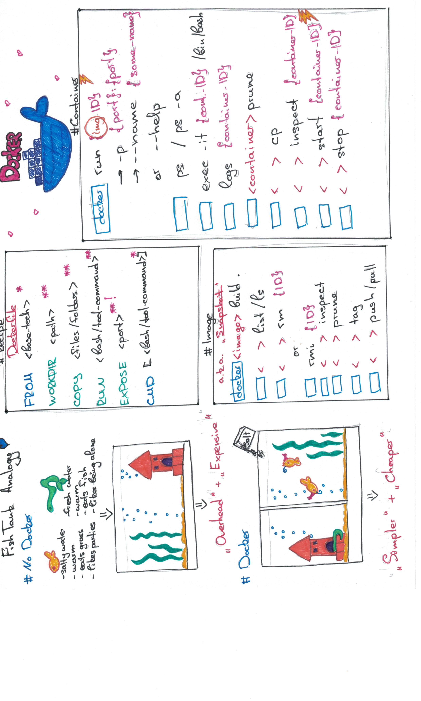

%title: One step closer to DevOps
%author: Alisa Dammer (FREE NOW)
-> Put it in a container, please
--------------------------------------------

---
-> Where to start?
==================
^
* Dockerfile = Recipe
^
* Image = snapshot
^
* Container = executing snapshot

---
-> How?
========
^
- make sure empty Dockerfile exists
^
- base: `FROM python:3.7`
^
- meta: `MAINTAINER Me+) <email>`
^
- set the start folder: `WORKDIR myapp/`
^
- file system needs files: `COPY app /myapp/app`
^
- don't forget other files: `COPY requirements.txt myapp/`
^
- install dependencies (as you normally would): `RUN pip install -r requirements.txt`
^
- communicate with the outside world: `EXPOSE 5000`
^
- Make the app work: `CMD ["python", "app/app.py"]`

---
-> CheatSheet
=============

---
-> What for?
============
^
* Simplicity
^
* Reproducibility 
^
* Scalability
^
* Collaboration+)
^
* Better sand boxing during development

